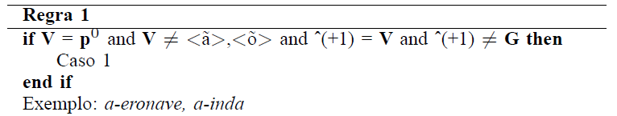

# sim-si-la-bim
A syllabifier for Brazilian Portuguese written in *foma*.

## intro

Text-to-speech (TTS) systems, the NLP task behind applications such as virtual assistants and screen readers, often performs syllabification as part of its text pre-processing pipeline. Syllabification is the process of breaking a given word into syllables and it's helpful for mapping a word into its phonetic transcription as well as to generate prosody, as for example, the tonic syllable in Brazilian Portuguese tends to have longer duration and intensity.

A few syllabifier algorithms have been proposed for the language, including that described in [(Silva et al.)](https://biblioteca.sbrt.org.br/articles/2721). Using that as reference, I have implemented the same rules in *foma*, a finite-state compiler and library.

## methodology

In their algorithm, the rules are based on the vowel(s) being the nucleus of each syllable, and the algorithm checks each vowel and determines which symbols around it will be considered to form a syllable, and from which those will be separated.

As an example, this is the first rule:


What the if statement says is: if the vowel is in the initial position of a syllable, it is different from `ã` and `õ`, and the following symbol is a vowel (not a semi-vowel), then it is a Case 1.

The Cases define what will be done with the vowel and the symbols around it; Case 1, for example, means the vowel will be separated from the following symbol.

Thus, the same rule is written in *foma* as below:

```
def VowelsExceptÃÕ V .o. ~[ ã | õ ];
def Rule1Case1 [..] -> "-" || VowelsExceptÃÕ _ V;
```

It is a rewrite rule that will insert a single hyphen (`[..] -> "-"`) into the space between a symbol that matches `VowelsExceptÃÕ` and another symbol that matches `V`. These two regular expressions have been defined based on Table 1 in the paper and translated below.

### symbols

The symbols considered as graphemes can be single letters or clusters of letters that should be handled together. For example, `ca` and `ce` are in different groups because the consonant `c` varies in sound depending on the vowel, such as in the words "casa" [kasa] and "cedo" [sɛdu].


| name | definition           | symbols                                                                      |
|------|----------------------|------------------------------------------------------------------------------|
| V    | Vowels               | `a`,`e`,`o`,`á`,`é`,`ó`,`í`,`ú`,`ã`,`õ`,`â`,`ê`,`ô`,`à`,`ü`                                  |
| G    | Semi-vowels          | `i`,`u`                                                                         |
| C    | All consonants       | `lh`,`nh`,`CO`,`CF`,`CL`,`CN`                                                   |
| CO   | Occlusive consonants | `p`,`t`,`ca`,`co`,`cu`,`que`,`qui`,`b`,`d`,`ga`,`go`,`gu`,`gue`,`gui` |
| CF   | Fricative consonants | `f`,`v`,`s`,`ce`,`ci`,`ç`,`z`,`ss`,`ch`,`j`,`ge`,`gi`,`x`                    |
| CL   | Liquid consonants    | `l` except `lh`,`r`,`rr`                                                         |
| CN   | Nasal consonants     | `m`,`n`                                                                         |

\* Some other symbols used in the paper such as `SP` (whitespace) and `F` (line break) were instead handled as *foma*-style rules as those will work with only one word at a time.

### cases
| case   | action                                                                                           |   |
|--------|--------------------------------------------------------------------------------------------------|---|
| Case 1 | Vowel is separated from the next grapheme                                                        |   |
| Case 2 | Vowel is joined with the next grapheme and separated from the subsequent   ones                  |   |
| Case 3 | Vowel is joined with the previous grapheme and separated from the   following                    |   |
| Case 4 | Vowel is joined with the previous and the next grapheme and separated   from the subsequent ones |   |
| Case 5 | Vowel is joined with the following 2 graphemes and separated from the 3rd   onwards              |   |
| Case 6 | Vowel is joined with the previous grapheme and all the following until   the end of the word     |   |


## how to use

The information on how to install *foma* is available in [its homepage](https://fomafst.github.io/).

```
foma[0]: source syllabifier.foma
```

With the source loaded, all of the rules will be compiled and the final Syllabifier transducer will be loaded and ready to use. In order to syllabify a word, the `apply down` shell can be used, and each word you input will be returned with hyphens separating the syllables.

```
foma[1]: apply down
apply down> aeronave
a-e-ro-na-ve
```

The word exemplified above, "aeronave" (aircraft), uses the first rule demonstrated in the previous section to define its first syllable, separating the vowels `a` from `e`. With the other rules already implemented, the transducer knows how to break apart the other syllables as well.

It can also handle a sequence of words.

```
apply down> morfologia
mor-fo-lo-gi-a
apply down> computacional
com-pu-ta-cio-nal
```

## references

D. Silva, D. Braga e F. Resende Jr. (2008). Separação das sílabas e determinação da tonicidade no Português Brasileiro. XXVI Simpósio Brasileiro de Telecomunicações, páginas 1–5.

Mans Hulden. 2009. Foma: a finite-state compiler andlibrary.  In Proceedings of the Demonstrations Session at EACL 2009, pages 29–32, Athens, Greece. Association for Computational Linguistics
